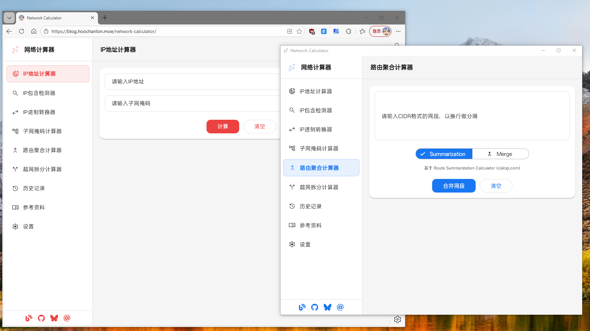

# Network Calculator



A modern network calculator application that provides professional IP address calculation, subnetting, route aggregation, and more. Built with Flutter, supporting Windows desktop and Web platforms.

**Language / Language / げんご**: [简体中文](README.md) | [English](README_EN.md) | [日本語](README_JA.md)


## ✨ Features

For design architecture, see: [Architecture-Diagrams](./docs/Architecture-Diagrams.md)

### Core Calculation Features

- **IP Address Calculator** - Calculate network information, broadcast address, available host count, etc.
- **Subnet Mask Calculator** - Calculate network parameters based on host count or subnet mask, supports binary and hexadecimal display
- **IP Base Converter** - Convert IP addresses between binary, decimal, and hexadecimal
- **Route Aggregation Calculator** - Merge multiple subnets into CIDR address blocks, supports two aggregation algorithms
- **Supernet Split Calculator** - Split large address blocks into multiple smaller network segments
- **IP Inclusion Detector** - Detect whether an IP address or network segment is included in another network segment

### User Experience

- 🎨 **Modern UI** - Web document-style interface design
- 🌓 **Theme Switching** - Support for light/dark themes with multiple color theme options
- 🌍 **Multi-language Support** - Simplified Chinese, Traditional Chinese, English, Japanese
- 📝 **History Records** - Automatically save calculation history with search, import, and export support
- 🔄 **State Persistence** - Automatically save input state, data is preserved when switching pages
- 📱 **Responsive Design** - Adapts to different screen sizes with adaptive sidebar width
- 🎯 **Sidebar Sorting** - Support for drag-and-drop sorting and item locking

## 🚀 Quick Start

### 1. Clone the project and install dependencies

```bash
git clone <repository-url> && cd Network-Calculator
flutter clean && flutter pub get
```

### 2. Run the project

**Desktop (Windows):**

```bash
flutter run -d windows
```

**Web:**

```bash
flutter run -d chrome
```

### 3. Troubleshooting

If you encounter Windows platform-related issues (symbolic link errors, plugin registration failures, build cache problems, etc.), you can use the one-click fix script:

**PowerShell (Recommended):**

```powershell
.\scripts\fix_flutter_issues.ps1
```

This script will automatically execute the following repair steps:

- Delete corrupted symbolic link directories
- Clean CMake cache
- Clean Flutter build cache
- Re-fetch dependency packages
- Regenerate plugin registration files
- Verify build configuration

After the repair is complete, you can run the application normally.

## 📦 Distribution

### 1. Executable Program Creation

**Build Windows desktop application:**

```bash
flutter build windows --release
```

Run the following batch file to view InnoSetup packaging instructions for creating an installer:

```powershell
InnoSetup.bat
```

Run the following batch file to view Enigma Virtual Box packaging instructions for creating a single executable:

```powershell
EnigmaVirtualBox.bat
```

### 2. Web Deployment

**Build Web application:**

```bash
flutter build web --release
```

1. Setting > Pages > Build and deployment > Action
2. Deploy to GitHub Pages

    ```bash
    # See GitHub Action deployment code
    cat .github/deploy.yml
    ```

