# 网络计算器 - 架构与技术原理图

本文档包含网络计算器应用的技术架构图和自动化部署流程图。

## 📐 技术架构图

### 应用整体架构

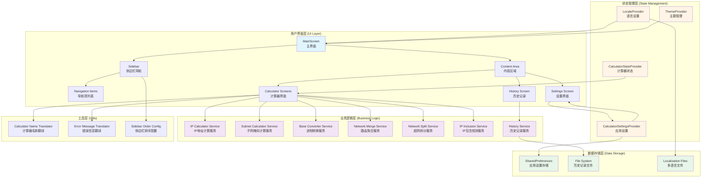

### 数据流图

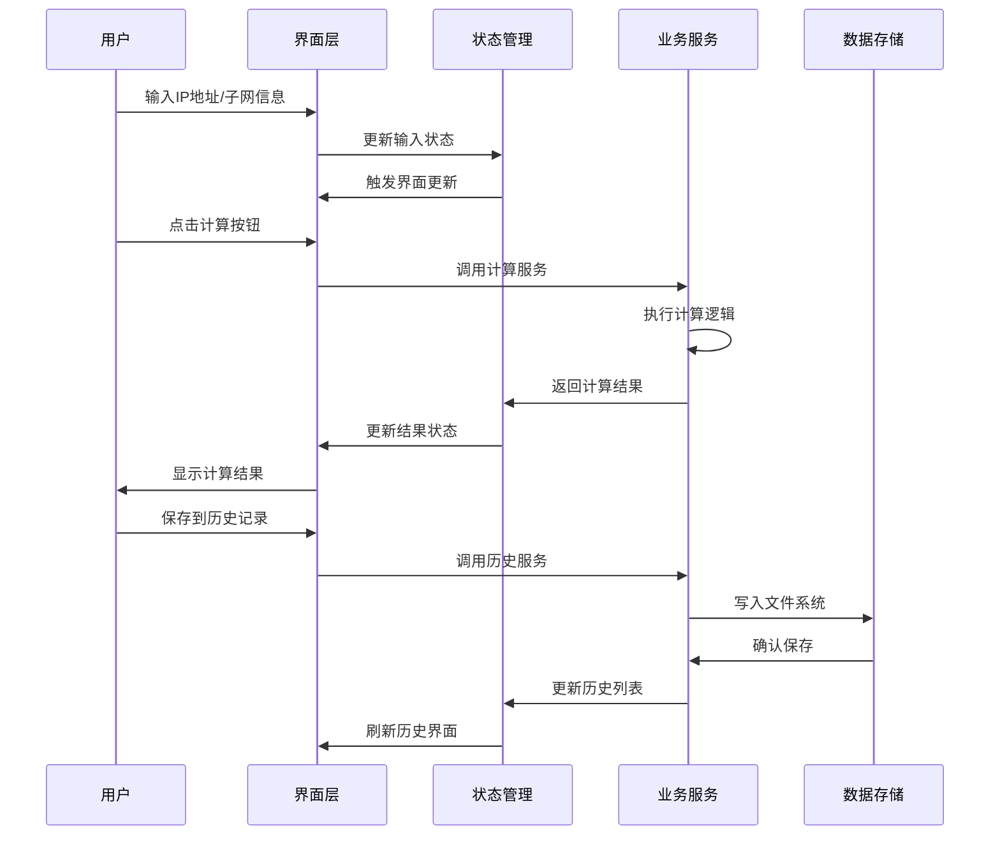

### 状态管理架构

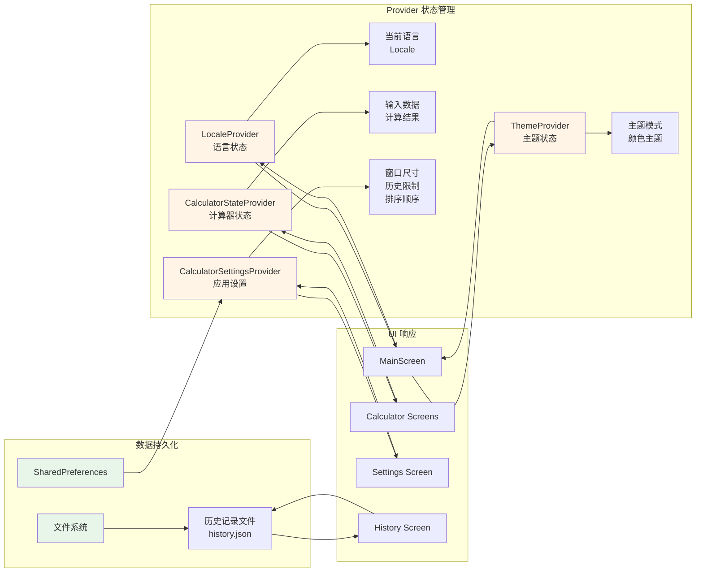

### 计算服务架构

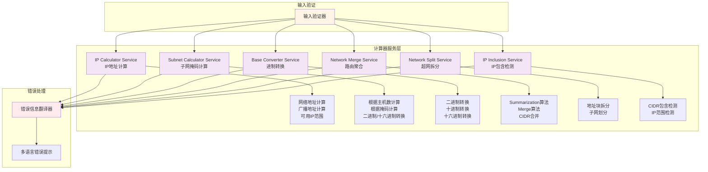

### 多语言支持架构

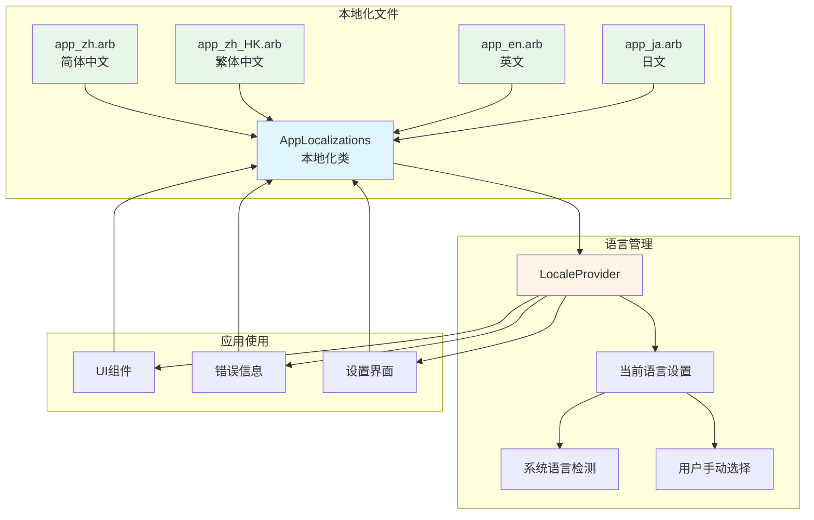

## 🚀 自动化部署与打包流程图

### 完整 CI/CD 流程

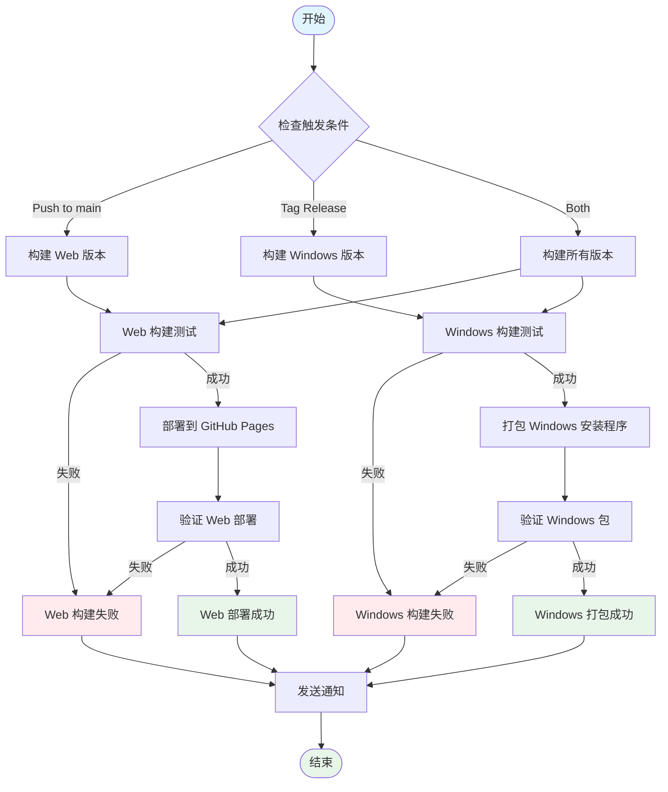

### Web 部署详细流程

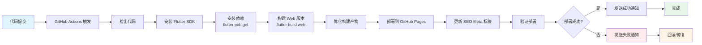

### Windows 打包详细流程

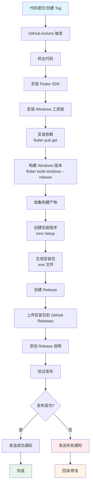

### 构建产物结构

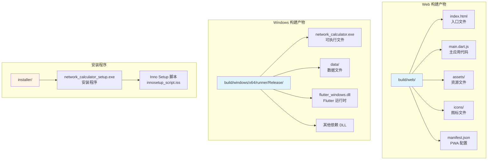

### GitHub Actions 工作流

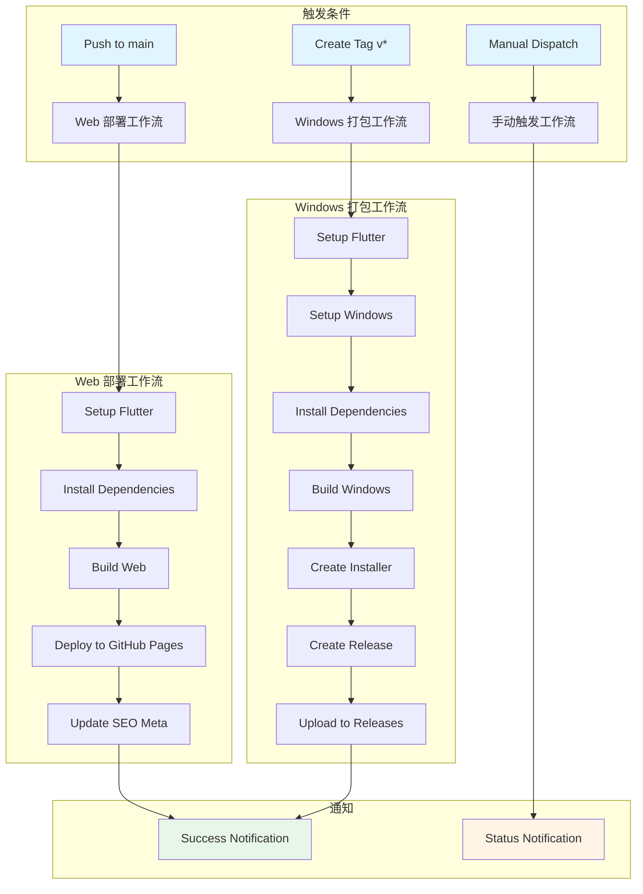

### 部署环境配置

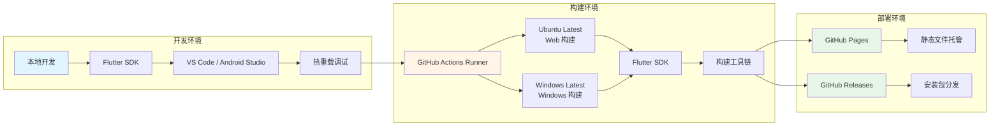

## 📝 说明

### 技术栈说明

- **框架**: Flutter 3.0+ (跨平台框架)
- **状态管理**: Provider (响应式状态管理)
- **本地化**: flutter_localizations + intl (多语言支持)
- **数据存储**: SharedPreferences (应用设置) + 文件系统 (历史记录)
- **UI 组件**: Material Design 3 (现代化 UI)
- **构建工具**: Flutter Build System
- **部署平台**: GitHub Pages (Web) + GitHub Releases (Windows)

### 关键特性

1. **模块化架构**: 清晰的层次分离，便于维护和扩展
2. **状态管理**: 使用 Provider 实现响应式状态管理
3. **多语言支持**: 支持中文、英文、日文等多种语言
4. **数据持久化**: 设置和历史记录持久化存储
5. **跨平台**: 同一套代码支持 Web 和 Windows 平台
6. **自动化部署**: 通过 GitHub Actions 实现自动化构建和部署

### 部署说明

- **Web 部署**: 自动部署到 GitHub Pages，支持 SEO 优化
- **Windows 打包**: 自动构建并创建安装程序，发布到 GitHub Releases
- **版本管理**: 通过 Git Tags 管理版本发布
- **通知机制**: 部署成功/失败时发送通知

