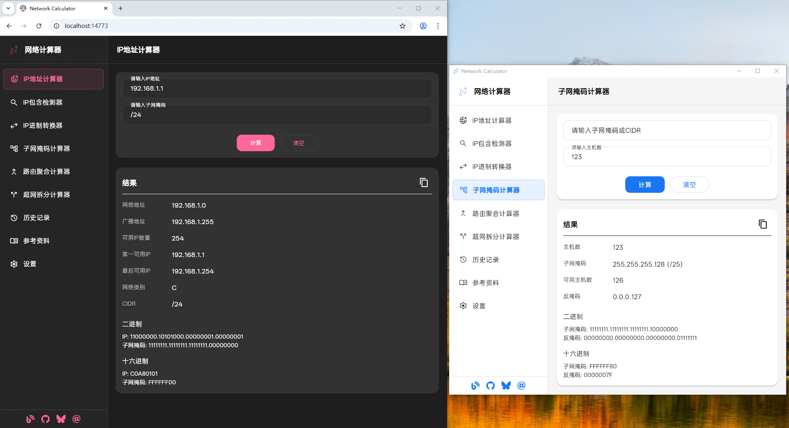
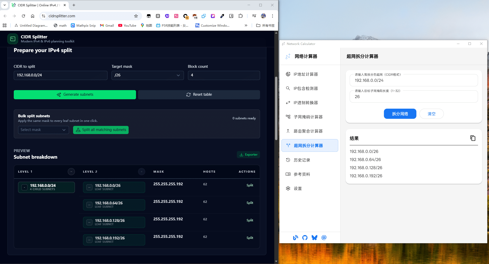
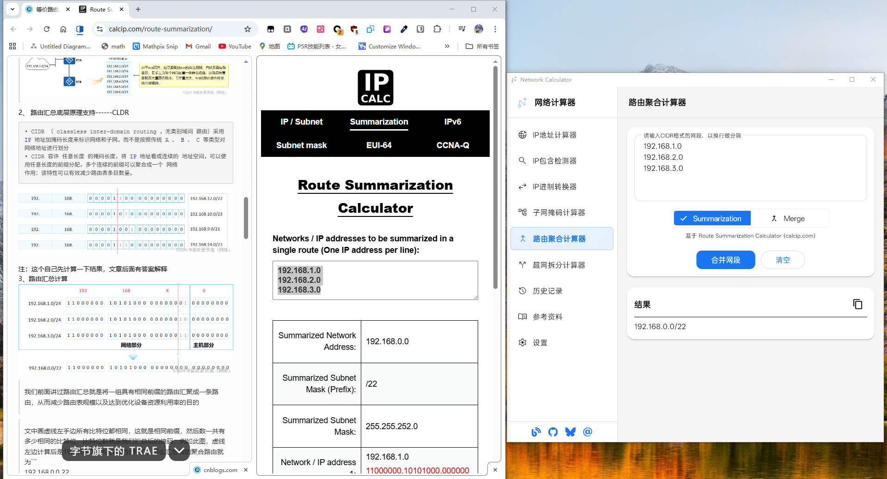
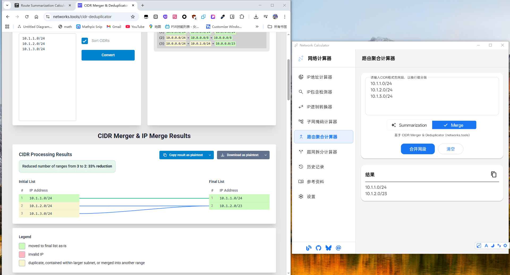
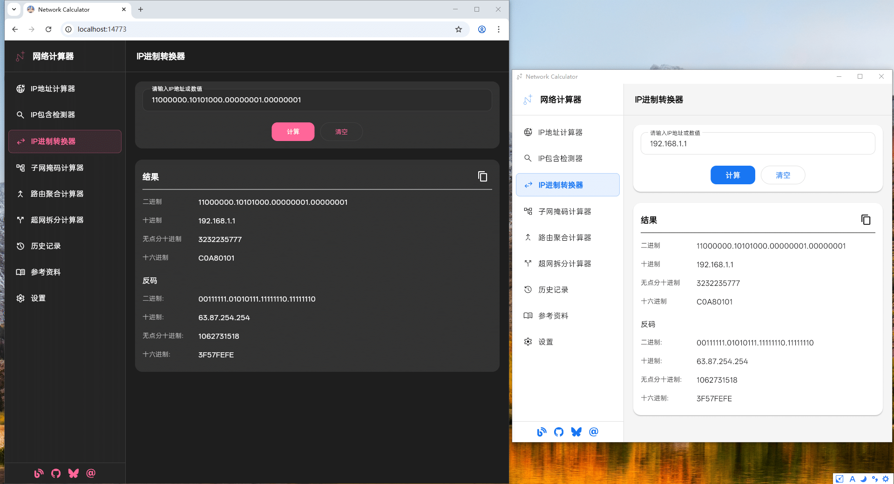
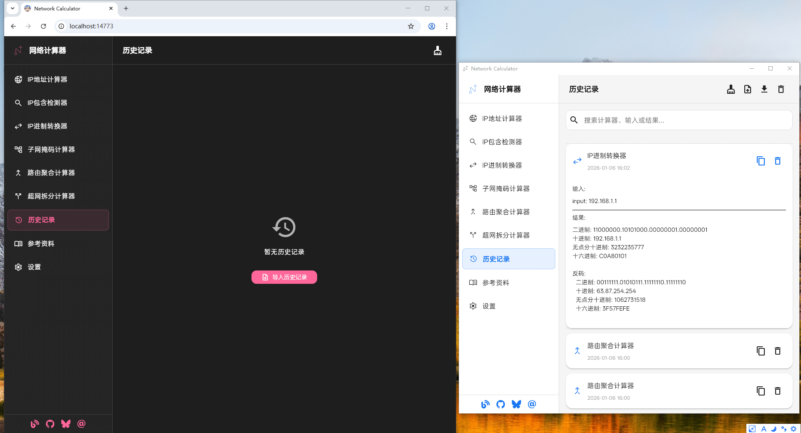

# 网络计算器 功能概览（配图版）

> 功能要点来自无图版文字说明，配图位于 `docs/imgs/`。

## 功能模块（对应示例配图）
1) **IP 地址 / 子网计算**  
   - 输出网络地址、广播地址、可用 IP 等。桌面端子网掩码计算可按主机数或掩码生成可用网段。  
   - 配图：

2) **超网拆分**  
   - 输入超网（CIDR）与目标掩码，生成拆分后的子网列表。  
   - 配图：

3) **路由汇总（算法对比）**  
   - 路由聚合示例，比较两种算法的汇总结果。  
   - 算法 A：  
   - 算法 B：

4) **进制转换**  
   - IP/数值在十进制、二进制、十六进制之间互转，结果即时显示。  
   - 配图：

5) **历史记录（导入 / 导出）**  
   - 支持搜索、导出、导入；“清除计算器状态” 会清空所有输入/结果缓存（Web 和桌面均生效）。  
   - 配图：

## 平台特性
- **Web 端**：导出历史会触发浏览器下载 JSON；导入通过文件内容；清除状态在当前浏览器环境生效。  
- **桌面端**：导出历史保存到系统下载目录（若不可用则退回应用文档目录）；导入使用文件路径；窗口尺寸与存储目录可定制。

## 语言与主题
- 多语言：简体中文、繁体中文（中国香港）、English (US)、日本語。  
- 主题：浅色 / 深色 / 跟随系统；支持自定义颜色主题。

